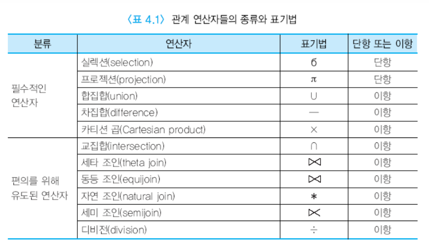
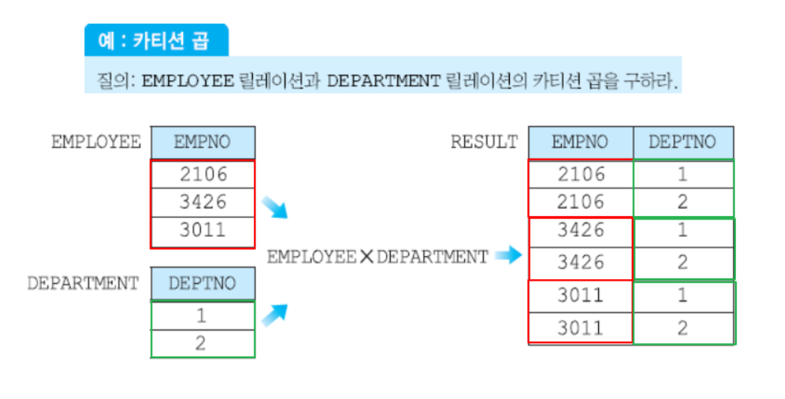
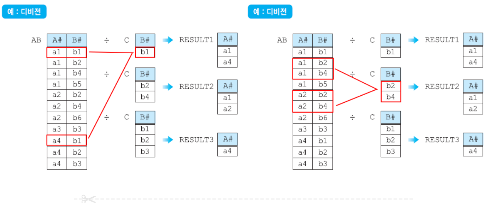

## Query가 DB에서 처리되는 과정을 간략히 설명하여라.

1. parser and translater: query를 사용가능한 형태로 변환한다. 이때 parser는 DB가 처리가능한 query가 맞는지 확인한다. (Query가 문법상 올바른지, 전송된 Schema, field가 DB상에 존재하는 Schema와 field가 맞는지 등을 확인한다.) 이렇게 확인작업을 거치며 parse tree형태로 query를 변환한다. 이렇게 변환된 parse tree는 관계 대수 표현식으로 변환된다.
2. Optimizer : 이렇게 변환된 관게대수 표현식을 기반으로 질의를 어떻게 처리할지 결정한다. 여러가지 평가 계획을 작성하고 비교하여 가장 최적의 평가계획을 결정한다.
3. Execution Engine : 산출된 평가 계획에 맞춰 실제 Query를 어떻게 수행하고 결과물을 산출한다.

### MySQL에서 Query 처리 과정을 설명하라.

### 아래는 대표적인 관계 대수 표현에 사용되는 기호이다. (Join은 다음 질문에서 다룬다.)

- selection($\sigma$): $\sigma$salary<75000은 salary가 75000미만인 데이터를 가져오라는 것을 의미한다. $\sigma$salary<75000(instructor)는 instructor테이블에서 salary가 75000미만인 모든 튜플을 가져오라는 것을 의미한다.
- projection($\pi$) : 대문자로($\Pi$)라고도 표현한다. 튜플중 해당하는 칼럼의 값만 가져오라는 것을 의미한다. $\Pi$salary는 salary Column만 가져올 것을 의미한다.

$\sigma$salary<75000($\Pi$salary(instructor))는 instructor 테이블에서 salary칼럼을 뽑아 그중 salary<75000인 튜플만 가져오라는 것을 의미한다.

- union(U) : 합집합을 구할것을 의미한다. 
Result 1 = $\sigma$salary<75000(instructor) 
Result 2 = $\sigma$salary>100000>(instructor) 
이라 할 때, ( Result 1 ) U ( Result 2 )
는 salary가 75000 미만이거나 100000초과인 교수 튜플을 가져오라는 것을 의미한다.

- difference(-) : 차집합을 구하라는 의미이다. 
Result 1 = $\sigma$salary<75000(instructor) 
Result 2 = $\sigma$department=ComputerSience>(instructor) 
이라 할 때, (Result 1) - (Result2)는 salary가 75000인 교수중에 부서가 컴공이 아닌 교수 튜플을 가져오라는 것을 의미한다.

- Cartesian Product(x) : 두 스키마의 조합가능한 모든 경우의 수를 구하라는 것을 의미한다. 이는 말로 표현하는 것 보다 그림으로 보는 것이 이해하기 쉬우므로 이미지로 첨부한다.
 
(출처: https://inpa.tistory.com/entry/DB-%F0%9F%93%9A-%EA%B4%80%EA%B3%84-%EB%8C%80%EC%88%98-%EA%B4%80%EA%B3%84-%ED%95%B4%EC%84%9D-SQL-%F0%9F%95%B5%EF%B8%8F-%EC%A0%95%EB%A6%AC)

- division($\div$) : A $\div$ B는 A에서 B를 포함하는 튜플만 가져오는 것을 의미한다. 마찬가지로 그림으로 표현한다.

## 아래 선택연산들의 cost를 설명하라. 
 단, 주요 연산 시간을 아래 변수를 사용하여 표현하라. 
tT : 디스크에서 한 블럭을 전송하는 시간 
tS : 블록 접근 시간 
hi : B+ tree의 높이

- Linear Search : tS + bN * tT  
최초 블럭을 찾는데 걸리는 시간(tS) 에 파일에 존재하는 모든 블럭의 수(bN) * 블럭 전송 시간(tT)를 더해서 구한다.
- Linear Search Equality on Key :
- Clustering B+ Tree Index, Equality on key :
- Clustering B+ Tree Index, Equality on Non-Key :
- Secondary B+ Tree Index, Equality on Non-Key :
- Clustering B+ Tree Index, Comparison :
- Secondary  B+ Tree Index, Comparison :

## DB에서 정렬이 필요한 이유가 무엇인가?

### 정렬 알고리즘 중, quick-sorting과 external sort-merge 알고리즘은 각각 언제 사용되는가?

### quick sorting 방식을 설명하라.

### quick sorting의 시간 복잡도는 어떻게 되는가?

### external sort-merge 방식을 설명하라.

### external sort-merge 방식의 비용을 설명하라.

## Join에는 굉장히 많은 방식이 존재하는데 아래 각각의 Join방식에 대해 설명하라.

### 중첩 루프 조인

### 블록 중첩 루프 조인

### 인덱스를 사용하는 중첩 루프 조인

### 합병 조인